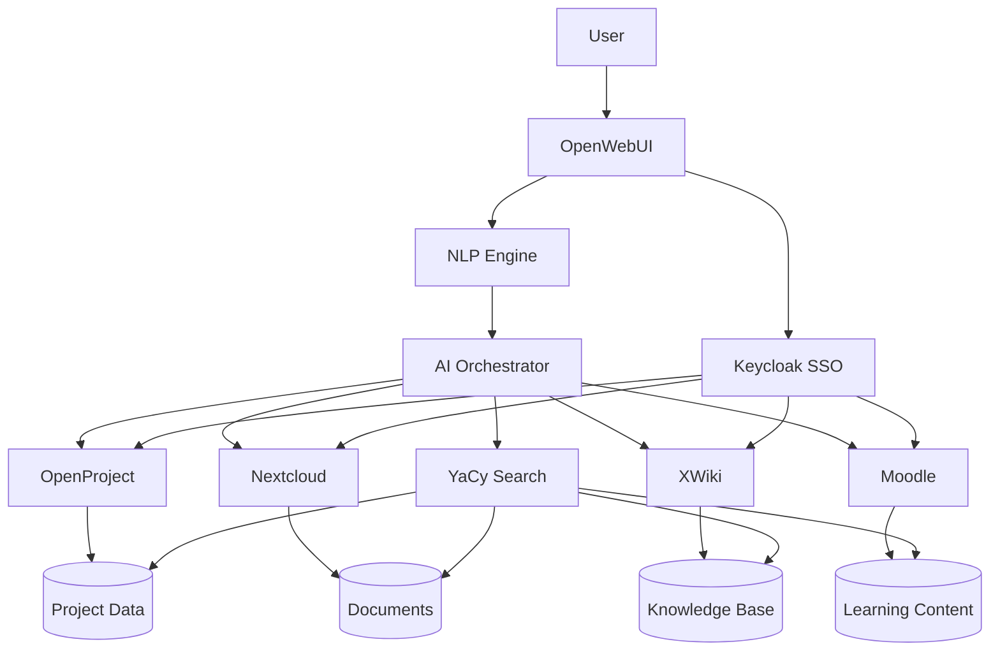
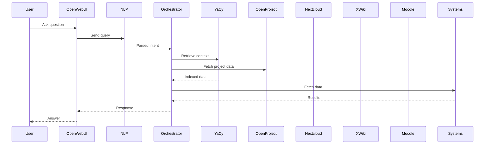
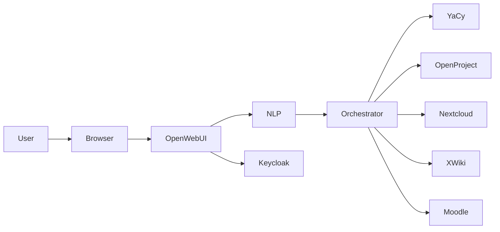

# scalenowAI Platform Architecture

## System Type
Microservices-based AI orchestration platform

---

## High-Level Architecture

```mermaid
graph TD
    User[User] --> UI[OpenWebUI]

    UI --> NLP[NLP Engine]
    NLP --> Orchestrator[AI Orchestrator]

    Orchestrator --> Search[YaCy Search]

    Orchestrator --> OpenProject[OpenProject]
    Orchestrator --> Nextcloud[Nextcloud]
    Orchestrator --> XWiki[XWiki]
    Orchestrator --> Moodle[Moodle]

    OpenProject --> PData[(Project Data)]
    Nextcloud --> DData[(Documents)]
    XWiki --> KData[(Knowledge Base)]
    Moodle --> LData[(Learning Content)]

    Search --> PData
    Search --> DData
    Search --> KData
    Search --> LData

    UI --> Keycloak[Keycloak SSO]
    Keycloak --> OpenProject
    Keycloak --> Nextcloud
    Keycloak --> XWiki
    Keycloak --> Moodle
```

---

## Sequence Flow

```mermaid
sequenceDiagram
    participant User
    participant UI as OpenWebUI
    participant NLP
    participant Orchestrator
    participant Search as YaCy
    participant OpenProject
    participant Nextcloud
    participant XWiki
    participant Moodle

    User->>UI: Ask question
    UI->>NLP: Send query
    NLP->>Orchestrator: Parsed intent

    Orchestrator->>Search: Retrieve context
    Orchestrator->>OpenProject: Fetch project data

    Search-->>Orchestrator: Indexed data

    Orchestrator->>Systems: Fetch data
    Systems-->>Orchestrator: Results

    Orchestrator-->>UI: Response
    UI-->>User: Answer
```

## Deployment Architecture

```mermaid
graph LR
    User --> Browser
    Browser --> OpenWebUI

    OpenWebUI --> NLP
    NLP --> Orchestrator

    Orchestrator --> YaCy
    Orchestrator --> OpenProject
    Orchestrator --> Nextcloud
    Orchestrator --> XWiki
    Orchestrator --> Moodle

    OpenWebUI --> Keycloak
```

